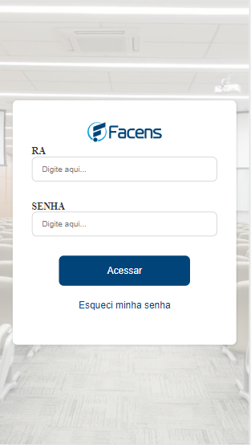
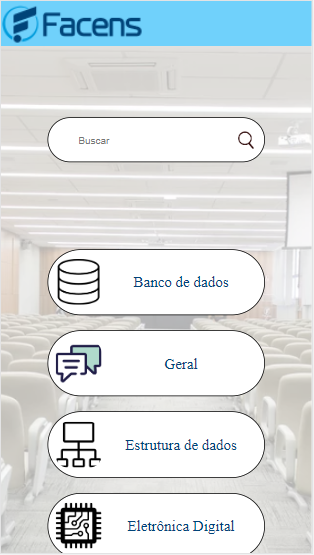

# Fórum Universitário

## 📃 **Sobre o projeto**

&nbsp;&nbsp;&nbsp;&nbsp;Projeto de cunho estudantil desenvolvido para as matérias de Projeto Aplicado VII e Desenvolvimento Mobile. 
<br>

&nbsp;&nbsp;&nbsp;&nbsp;A aplicação irá abranger conceitos de fóruns como o reddit, com o diferencial de ser voltado para uso academico de professores e alunos da FACENS. <br>

<br>

---

## 🛠 **Metodologia**

Projeto desenvolvido com as tecnologias abaixo:

- ReactJS
- CSS
- -Styled Components
- NodeJS
- Firebase
 
<br>

---

## **Como testar o projeto** 

Será necessário ter o git instalado:

-Instale o git:
   [Git](https://git-scm.com/downloads)&nbsp;( 
-Navegue até a pasta onde deseja baixar o projeto e execute o comando abaixo no seu terminal:

`git clone https://github.com/takaozando/forumUniversitario.git`

<br>

---

Após clonar(baixar) o projeto na sua maquina, acesse o diretório da aplicação ".../forumUniversitario" e execute o comando abaixo no terminal:

```
npm start
```

A aplicação deverá abrir seu navegador padrão na url abaixo automaticamente. Caso isso não ocorra, abra seu navegador e acesse a url:
```
http://localhost:3000
```
<br>

<br>

---
## Prévia
<h1  >
    <p align="center">
Página de login <br>
    <p align="center"> <br></p>
    <p align="center">
Página inicial <br>
    <p align="center"> <br></p>
    <p align="center">
Tópicos <br>    
    <p align="center"> <br></p>
    <p align="center">
Página de discussão <br>
    <p align="center"> <br></p>
    </p>
    

</h1>


## Criado por ⚙

| Author | Description |
| :---: | :--- |
 | **Gustavo Hideo Takao (https://github.com/takaozando)**<br> 191005 - (PA VII, Mobile) .<br> ||
 | **Guilherme Koji Yamada (https://github.com/gkojiyamada)**<br> 173271 - (PA VII, Mobile).<br> ||
 | **Gustavo Henrique Coimbra Galo (https://github.com/GustavoGalo)**<br> 190667 - (PA VII)
